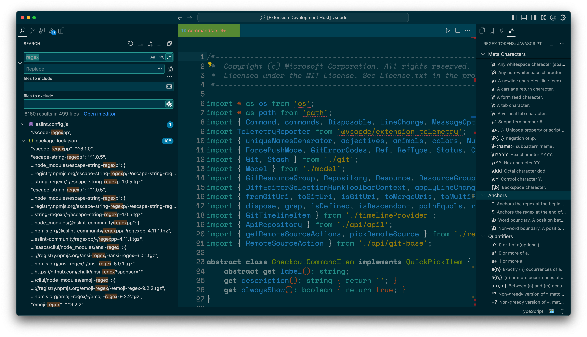

# Regex Tokens

Regex Tokens is a cheat sheet directly in VS Code to help you write your regular expressions.
If you use RegEx with the VS Code Search view. It will work best if you place the **Regex Tokens** view in the sidebar opposite of the Search view.

#### `'T' for Tokens!`
Pressing (⌘⌥T) while in the Search View will open Regex Tokens

While Regex Tokens is visible pressing (⌘⌥T) will toggle the view between all the tokens shown at once, and the tokens separated by groups.

Clicking on a token will copy it's value to the clipboard so you can paste it where you would like.

Clicking the `...` button in **Regex Tokens** will give you the option to switch to a different programming language.
The Currently supported languages are:
- javascript/typescript

coming soon: 
- python 
- lua
